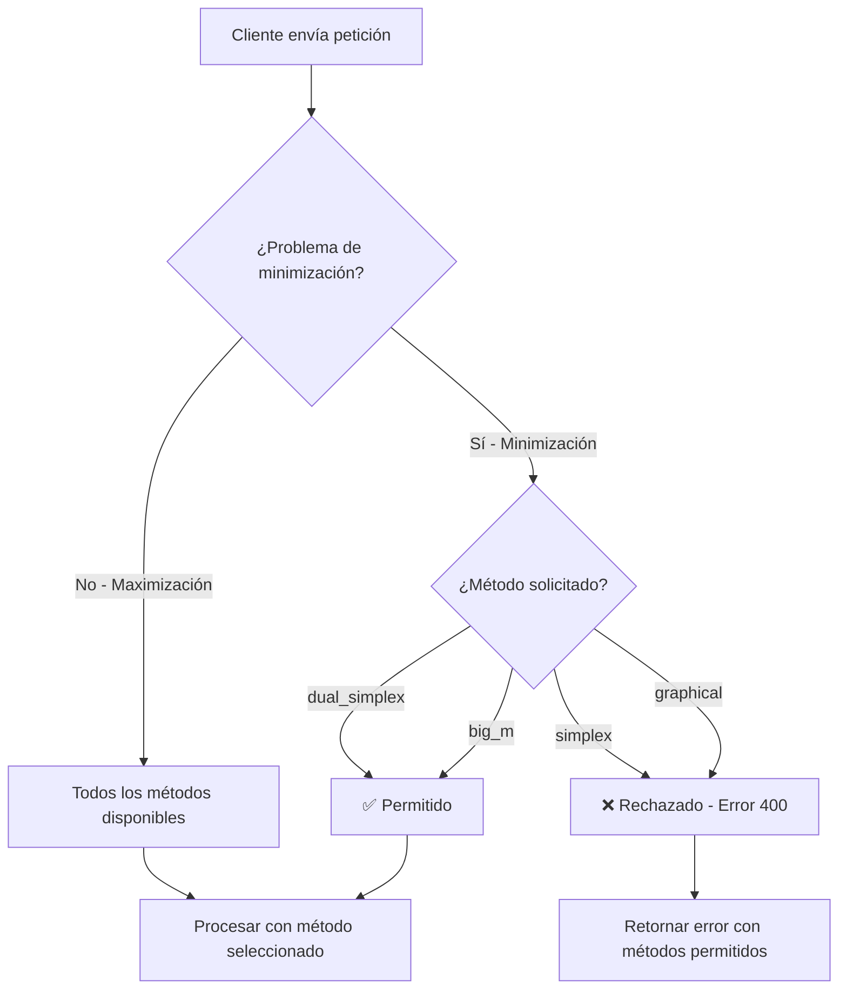

# Validación de Métodos para Problemas de Minimización

## 📋 Resumen

Se ha implementado una validación que **restringe los métodos de solución disponibles** según el tipo de problema (maximización o minimización).

### ✅ Reglas Implementadas

| Tipo de Problema | Métodos Permitidos | Métodos NO Permitidos |
|-----------------|-------------------|----------------------|
| **Minimización** | ✅ Simplex Dual<br>✅ Gran M | ❌ Simplex Normal<br>❌ Método Gráfico |
| **Maximización** | ✅ Simplex Normal<br>✅ Simplex Dual<br>✅ Gran M<br>✅ Método Gráfico | Ninguno |

---

## 🎯 Motivación

En optimización lineal, los **problemas de minimización** requieren enfoques específicos:

1. **Simplex Dual**: Diseñado específicamente para problemas de minimización con restricciones `>=`
2. **Gran M**: Puede manejar tanto maximización como minimización mediante transformaciones

Los métodos **Simplex Normal** y **Método Gráfico** están optimizados para problemas de **maximización**, por lo que se restringen en minimización para evitar errores y confusiones.

---

## 🔧 Implementación Técnica

### 1. Validación en el Endpoint (`webapp/views.py`)

```python
@csrf_exempt
@require_POST
def solve_model(request: HttpRequest) -> JsonResponse:
    """Resuelve un modelo matemático con el método seleccionado."""
    try:
        payload = json.loads(request.body.decode('utf-8'))
        model_dict = payload.get('model')
        if not model_dict:
            return _json_response({'detail': "Falta campo 'model' en payload"}, status=400)
        
        model = MathematicalModel(**model_dict)
        method = payload.get('method', 'simplex')
        
        # ✅ VALIDACIÓN AGREGADA
        if model.objective == "min" and method not in ["dual_simplex", "big_m"]:
            return _json_response({
                'success': False,
                'detail': f"Los problemas de minimización solo pueden resolverse con el Método Simplex Dual o el Método de la Gran M. El método '{method}' no está disponible para minimización.",
                'allowed_methods': ["dual_simplex", "big_m"],
                'objective_type': 'min'
            }, status=400)
        
        # ... resto del código
```

**Ubicación**: `backend/webapp/views.py` - Líneas ~213-219

---

### 2. Validación en el Servicio (`app/services/solver_service.py`)

```python
def solve(self, model: MathematicalModel, method: str = "simplex") -> Dict[str, Any]:
    """Resuelve usando Simplex tableau, Gran M, Simplex Dual o método gráfico según el método."""
    try:
        # ✅ VALIDACIÓN AGREGADA
        if model.objective == "min":
            if method not in ["dual_simplex", "big_m"]:
                return {
                    "success": False,
                    "error": f"Los problemas de minimización solo pueden resolverse con el Método Simplex Dual o el Método de la Gran M. El método '{method}' no está disponible para minimización.",
                    "allowed_methods": ["dual_simplex", "big_m"],
                    "objective_type": "min"
                }
        
        # ... resto del código
```

**Ubicación**: `backend/app/services/solver_service.py` - Líneas ~79-89

---

### 3. Actualización de `determine_applicable_methods()`

```python
def determine_applicable_methods(self, model: MathematicalModel) -> Tuple[List[str], Dict[str, str]]:
    """Retorna métodos sugeridos y no aplicables."""
    needs_big_m = self._needs_big_m(model)
    is_dual_simplex_candidate = self._is_dual_simplex_candidate(model)
    
    is_minimization = model.objective == "min"
    not_applicable = {}
    suggested = []
    
    # ✅ LÓGICA PARA MINIMIZACIÓN
    if is_minimization:
        if is_dual_simplex_candidate:
            suggested.append("dual_simplex")
        if needs_big_m:
            suggested.append("big_m")
        if not suggested:
            suggested.append("dual_simplex")  # Al menos ofrecer dual_simplex
        
        # Marcar métodos no permitidos
        not_applicable["simplex"] = "No disponible para problemas de minimización"
        not_applicable["graphical"] = "No disponible para problemas de minimización"
    else:
        # ✅ LÓGICA PARA MAXIMIZACIÓN (sin cambios)
        suggested = ["simplex"]
        if needs_big_m:
            suggested.insert(0, "big_m")
        if is_dual_simplex_candidate:
            suggested.insert(0, "dual_simplex")
        
        if len(model.variables) > 2:
            not_applicable["graphical"] = "Más de 2 variables"
        else:
            suggested.append("graphical")
    
    return suggested, not_applicable
```

**Ubicación**: `backend/app/services/solver_service.py` - Líneas ~46-84

---

## 🧪 Pruebas

Se ha creado un script de prueba completo en `test_minimization_validation.py` que verifica:

### ✅ Casos de Prueba Exitosos

1. **Minimización + Simplex Normal** → ❌ Rechazado correctamente
2. **Minimización + Método Gráfico** → ❌ Rechazado correctamente
3. **Minimización + Simplex Dual** → ✅ Permitido y funcional
4. **Minimización + Gran M** → ✅ Permitido y funcional
5. **Maximización + Simplex Normal** → ✅ Permitido y funcional
6. **Maximización + Método Gráfico** → ✅ Permitido y funcional
7. **`determine_applicable_methods()`** → ✅ Retorna valores correctos

### Ejecutar Pruebas

```bash
cd backend
python test_minimization_validation.py
```

---

## 📊 Respuestas de Error

Cuando se intenta usar un método no permitido en minimización:

### HTTP Response (Status 400)
```json
{
  "success": false,
  "detail": "Los problemas de minimización solo pueden resolverse con el Método Simplex Dual o el Método de la Gran M. El método 'simplex' no está disponible para minimización.",
  "allowed_methods": ["dual_simplex", "big_m"],
  "objective_type": "min"
}
```

### Service Response
```python
{
  "success": False,
  "error": "Los problemas de minimización solo pueden resolverse con el Método Simplex Dual o el Método de la Gran M. El método 'graphical' no está disponible para minimización.",
  "allowed_methods": ["dual_simplex", "big_m"],
  "objective_type": "min"
}
```

---

## 🔄 Flujo de Validación



---

## 📝 Ejemplos de Uso

### ❌ Ejemplo de Uso INCORRECTO (será rechazado)

```python
from app.schemas.analyze_schema import MathematicalModel
from app.services.solver_service import SolverService

model = MathematicalModel(
    objective_function="2*x1 + 3*x2",
    objective="min",  # ⚠️ MINIMIZACIÓN
    constraints=["x1 + x2 >= 4", "x1 >= 0", "x2 >= 0"],
    variables={"x1": "Var 1", "x2": "Var 2"}
)

solver = SolverService()
result = solver.solve(model, method="simplex")  # ❌ SERÁ RECHAZADO

# Resultado:
# {
#   "success": False,
#   "error": "Los problemas de minimización solo pueden resolverse...",
#   "allowed_methods": ["dual_simplex", "big_m"]
# }
```

### ✅ Ejemplo de Uso CORRECTO

```python
from app.schemas.analyze_schema import MathematicalModel
from app.services.solver_service import SolverService

model = MathematicalModel(
    objective_function="2*x1 + 3*x2",
    objective="min",  # MINIMIZACIÓN
    constraints=["x1 + x2 >= 4", "x1 >= 0", "x2 >= 0"],
    variables={"x1": "Var 1", "x2": "Var 2"}
)

solver = SolverService()

# ✅ OPCIÓN 1: Usar Simplex Dual
result = solver.solve(model, method="dual_simplex")

# ✅ OPCIÓN 2: Usar Gran M
result = solver.solve(model, method="big_m")

# Ambos retornarán una solución exitosa
```

---

## 🎓 Fundamentos Teóricos

### ¿Por qué esta restricción?

1. **Simplex Normal**: Diseñado para forma estándar con restricciones `<=` (típico de maximización)
   - Requiere conversión compleja para minimización
   - Puede generar confusión en la interpretación

2. **Método Gráfico**: Visualiza regiones factibles basadas en restricciones `<=`
   - La interpretación visual cambia significativamente en minimización
   - La dirección de optimización es opuesta

3. **Simplex Dual**: 
   - Método natural para minimización con restricciones `>=`
   - Trabaja en el espacio dual del problema
   - Eficiente y teóricamente correcto

4. **Gran M**:
   - Método universal que maneja ambos tipos
   - Usa variables artificiales y penalizaciones
   - Funciona para cualquier combinación de restricciones

---

## 📚 Referencias

- **Archivo de Implementación Principal**: `app/services/solver_service.py`
- **Endpoint HTTP**: `webapp/views.py` → `solve_model()`
- **Pruebas**: `test_minimization_validation.py`
- **Documentación de Simplex Dual**: `DUAL_SIMPLEX_README.md`
- **Documentación de Gran M**: `backend/README.md`

---

## ✨ Beneficios de esta Validación

1. **Previene errores**: Evita que usuarios intenten métodos inadecuados
2. **Guía educativa**: Enseña qué métodos usar según el tipo de problema
3. **Mensajes claros**: Respuestas de error informativas con alternativas
4. **API robusta**: Validación en múltiples capas (endpoint + servicio)
5. **Documentación automática**: `determine_applicable_methods()` informa dinámicamente

---

**Fecha de Implementación**: Noviembre 27, 2025  
**Versión**: 1.0  
**Estado**: ✅ Implementado y Probado
